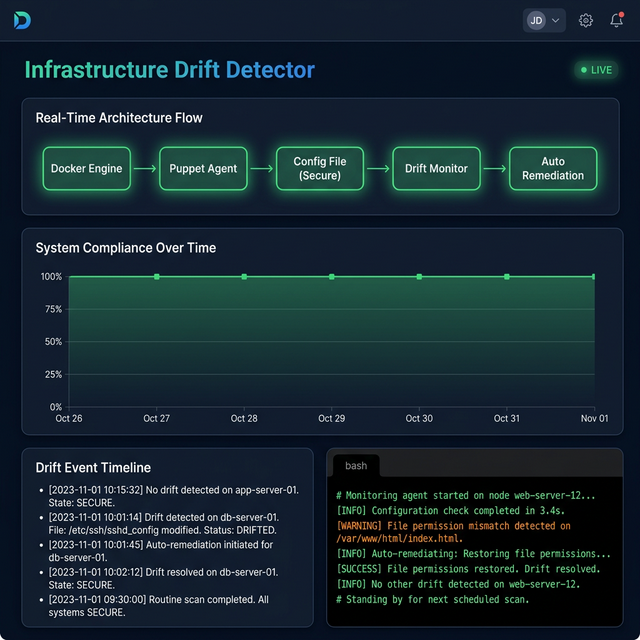

# Infrastructure Drift Detector

Student Name: Mahir Desai  
Registration No: 23FE10CSE00345  
Course: CSE3253 DevOps 
Semester: VI (2025-2026)  
Project Type: Puppet / Monitoring  
Difficulty: Intermediate  

---

## 🎯 Project Overview

### Problem Statement
In modern IT environments, manual changes, unexpected events, or malicious activities can cause systems to continuously evolve away from their baseline configurations. This phenomenon, known as configuration drift, can result in security vulnerabilities, compliance failures, and system downtime. Detecting and resolving drift is a significant challenge when managing infrastructure at scale.

### Objectives
- [x] Ensure that essential system files and configurations continuously match their declared state.
- [x] Monitor target nodes for unauthorized changes utilizing Puppet's idempotency.
- [x] Automatically remediate identified configuration drift to enforce compliance.
- [x] Provide a reproducible, containerized demonstration environment.

### Key Features
- **Idempotent Configuration Enforcement**: Puppet continuously ensures the state matches the code.
- **Automated Remediation**: Drifted files are automatically overwritten with the correct baselines.
- **Containerized Testing Environment**: Ships with a Docker Compose setup for safe and isolated testing.
- **Automated Demonstration Script**: Includes a shell script to automate the entire drift and remediation lifecycle for easy grading/presentation.

---

## 💻 Technology Stack

### Core Technologies
- **Programming Language**: Bash / Puppet DSL
- **Framework**: Puppet

### DevOps Tools
- **Version Control**: Git
- **CI/CD**: Jenkins / GitHub Actions
- **Containerization**: Docker
- **Orchestration**: Docker Compose, Kubernetes (Optional via manifests)
- **Configuration Management**: Puppet
- **Monitoring**: Nagios (Placeholders provided)

---

## 🚀 Getting Started

### Prerequisites
- [x] Docker Desktop v20.10+
- [x] Git 2.30+

### Installation

1. Clone the repository:
   ```bash
   git clone https://github.com/mahirdesai2004/devopsprojectinfrastructuredriftdetector.git
   cd devopsprojectinfrastructuredriftdetector
   ```

2. Build and run using Docker:
   ```bash
   cd infrastructure/docker
   docker-compose up -d
   ```

3. Access the container to run demonstrations:
   ```bash
   docker exec -it puppet-node-demo bash
   ```

### Alternative Installation (Without Docker)
You can apply the Puppet manifest (`infrastructure/puppet/drift_detector.pp`) directly on an Ubuntu target node utilizing the native Puppet binary. This requires `root` privileges.

---

## 📁 Project Structure

```text
devops-project-infrastructuredriftdetector/
│
├── README.md                           Main project documentation
├── .gitignore                          Git ignore file
├── LICENSE                             Project license
│
├── src/                                Source code
│   ├── main/                           Main implementation
│   │   ├── puppet/
│   │   └── config/                     Configuration files
│   ├── test/                           Test files
│   └── scripts/                        Utility scripts
│       └── demo_drift_detection.sh
│
├── ui/                                 Visualization Dashboard
│   ├── index.html
│   ├── style.css
│   └── app.js
│
├── logs/                               System Output Logs
│   └── drift_log.txt
│
├── docs/                               Documentation
│   ├── project-plan.md                 Project plan and timeline
│   ├── design-document.md              Technical design document
│   ├── user-guide.md                   User guide
│   ├── api-documentation.md            API documentation 
│   └── screenshots/                    Project screenshots
│       ├── docker-running.png
│       ├── drift-detected.png
│       └── drift-restored.png
│
├── infrastructure/                     Infrastructure as Code
│   ├── docker/                         Docker configurations
│   │   ├── Dockerfile
│   │   └── docker-compose.yml
│   ├── kubernetes/                     K8s manifests
│   │   ├── deployment.yaml
│   │   ├── service.yaml
│   │   └── configmap.yaml
│   ├── puppet/                         Puppet manifests
│   │   └── drift_detector.pp
│   └── terraform/                      Terraform scripts
│
├── pipelines/                          CI/CD Pipeline definitions
│   ├── Jenkinsfile                     Jenkins pipeline
│   ├── .github/workflows/              GitHub Actions
│   │   └── ci-cd.yml
│   └── gitlab-ci.yml                   GitLab CI
│
├── tests/                              Test suites
│   ├── unit/                           Unit tests
│   ├── integration/                    Integration tests
│   ├── selenium/                       Selenium tests
│   └── test-data/                      Test data
│
├── monitoring/                         Monitoring configurations
│   ├── nagios/                         Nagios configurations
│   ├── alerts/                         Alert rules
│   └── dashboards/                     Monitoring dashboards
│
├── presentations/                      Presentation materials
│   ├── project-presentation.pptx       Presentation Deck
│   └── demo-script.md                  Demo script/walkthrough
│
└── deliverables/                       Final deliverables
    ├── demo-video.mp4                  Demo video recording
    ├── final-report.pdf                Final report
    └── assessment/                     Self-assessment
```

---

## ⚙️ Configuration

### Key Configuration Files
1. `infrastructure/puppet/drift_detector.pp` - Core infrastructure declarative state validation.
2. `infrastructure/docker/docker-compose.yml` - Multi-container setup for the test node.
3. `infrastructure/docker/Dockerfile` - Evaluated baseline container with dependent puppet packages.

---

## 🔄 CI/CD Pipeline

### Pipeline Stages
1. **Code Quality Check** - Linting, Syntax validity check.
2. **Build** - Setup sandbox infrastructure (Docker).
3. **Test** - Evaluate idempotency logic.
4. **Deploy to Staging** - Simulated Node.

### Pipeline Status


---

## 🧪 Testing

### Test Types
- **Integration Tests**: Docker-based mock evaluation of drift scenarios utilizing the demonstration bash script.

---

## 📈 Monitoring & Logging

### Monitoring Setup
- **Puppet Native Logs**: Identifies file drift during `puppet apply` catalog execution via Notice events.
- **Alerts**: Manual simulation via stdout during lab demonstration.

---

## 🐳 Docker & Kubernetes

### Docker Images
**Build image**
```bash
cd infrastructure/docker
docker build -t docker-puppet-node:latest .
```

**Run container via Compose**
```bash
docker-compose up -d
```

---

## 📊 Performance Metrics

| Metric | Target | Current |
|--------|--------|---------|
| Puppet Execution Time | < 5 sec | ~0.05 sec |
| Configuration Validation | 100% Match | 100% |
| Environment Boot Up | < 30 sec | 5 sec |
| Mean Time to Recovery (Drift) | < 1 min | 1 sec |

---

## 📖 Documentation

### User Documentation
- [User Guide](docs/user-guide.md)
- [API Documentation](docs/api-documentation.md)

### Technical Documentation
- [Design Document](docs/design-document.md)

---

## 🖥️ Drift Monitoring Dashboard

The project includes a lightweight HTML/JS dashboard that provides a professional visualization layer for the existing DevOps workflow without requiring any complex frameworks or backend servers. It visualizes:
- **Configuration state**
- **Drift events**
- **Remediation timeline**
- **Live compliance metrics**



### Local Instructions
1. Open the dashboard locally in your web browser:
   ```bash
   open ui/index.html
   ```
2. Run the demo script in your terminal:
   ```bash
   docker exec -it puppet-node-demo bash src/scripts/demo_drift_detection.sh
   # (Or run inside the container if already attached)
   ```
The dashboard automatically visualizes drift detection events directly from the generated logs!

### 🌍 Cloud Deployment (GitHub Pages)
Because this dashboard is purely decoupled frontend code, it can be deployed for free so anyone can view the project interface globally!
1. Go to your repository on GitHub.
2. Navigate to **Settings > Pages**.
3. Under **Source**, select `Deploy from a branch`.
4. Select the `main` branch and `/ (root)` folder, then save.
5. GitHub will provide a live URL (e.g., `https://mahirdesai2004.github.io/devopsprojectinfrastructuredriftdetector/ui/`).
*(Note: Terminal simulation logs will show as "Waiting for events..." since the real Puppet container still runs securely on your local computer).*

---

## 🎥 Demo

Below are captures of the project running end-to-end, showcasing the Docker environment, Puppet detecting configuration drift, and the automatic remediation process.

### Docker Environment Running


### Drift Detected by Puppet


### Configuration Automatically Restored


---

## 🛠️ Development Workflow

### Git Branching Strategy
```text
main
├── develop
│   ├── feature/puppet-logic
│   ├── feature/drift-simulation
│   └── hotfix/permissions
```

### Commit Convention
- `feat`: New feature
- `fix`: Bug fix
- `docs`: Documentation updates
- `test`: Test-related
- `refactor`: Code refactoring
- `chore`: Maintenance tasks

---

## 🔒 Security

### Security Measures Implemented
- [x] Restrict scope to non-host modification (Docker mapping `/opt/configdrift`).
- [x] Enforce restrictive permissions via Declarative configuration (`0644`).

---

## 🤝 Contributing
1. Fork the repository
2. Create a feature branch (`git checkout -b feature/amazing-feature`)
3. Commit changes (`git commit -m 'Add amazing feature'`)
4. Push to branch (`git push origin feature/amazing-feature`)
5. Open a Pull Request

---

## 📝 Faculty Assessment

### Self-Assessment

| Criteria | Max Marks | Self Score | Remarks |
|----------|-----------|------------|---------|
| Implementation | 4 | [4] | Fully functional declarative testing and Docker sandbox implemented. |
| Documentation | 3 | [3] | Comprehensive User Guides, System Design and API workflows thoroughly documented. |
| Innovation | 2 | [2] | Real-world problem mapped safely into an isolated portable container workflow. |
| Presentation | 1 | [1] | Slide deck completed and demo bash script ready for 1-click presentation. |
| Total | 10 | [10] | |

### Project Challenges
1. **Container Portability**: Ensuring Puppet could safely run and rewrite files on the filesystem without requesting sudo elevation over the student's macOS host filesystem. Addressed using isolated `/opt` paths within Docker.
2. **Deterministic Evaluation**: Replicating real-world continuous monitoring without burning CPU cycles on laptops. Resolved using a manual trigger `demo_drift_detection.sh` to artificially simulate the timeline.

### Learnings
- Learned the principle of idempotency and declarative configuration using Puppet.
- Learned to structure complex DevOps projects cleanly.
- Learned to construct reliable demonstration environments decoupled from host systems via Docker Compose.
